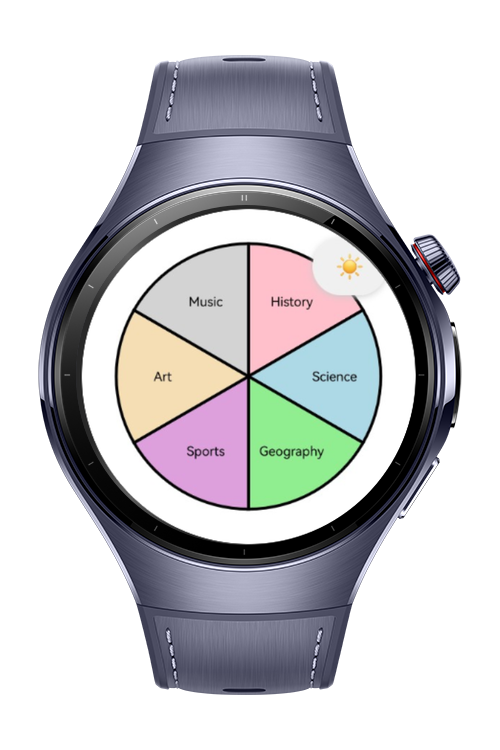
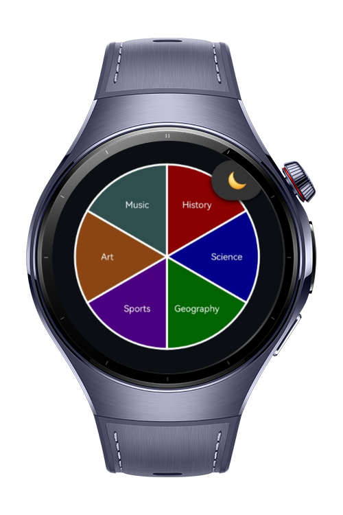
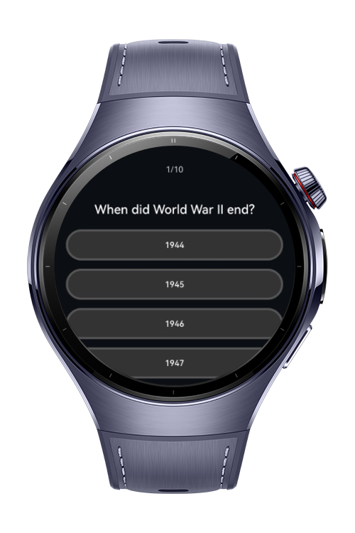

> **Note:** To access all shared projects, get information about environment setup, and view other guides, please visit [Explore-In-HMOS-Wearable Index](https://github.com/Explore-In-HMOS-Wearable/hmos-index).

# QuizGame

This is a basic quiz game that user can save the mode preferences(light mode/ dark mode) once and use it till change it again. 

## Preview

<div>
    
    
    
    
</div>

## Use Cases

- User can select theme for the app.
- User can select topic and start quiz.
- User can learn success rate of the quiz and turn back to topics.
- And even user close the app and reopen it, theme stays the same.

## Tech Stack

- **Languages**: ArkTS, ArkUI
- **Frameworks**: HarmonyOS SDK 5.1.0(18)
- **Tools**: DevEco Studio Vers 5.1.0.842
- **Libraries**: 
    - `@kit.ArkUI`
    - `@kit.ArkData` 
    - `@kit.PerformanceAnalysisKit`
    - `@kit.CoreFileKit`

## Directory Structure
```
entry/src/main/ets/        
|---components      
|   |---QuizPage.ets               
|   |---QuizResultPage.ets   
|   |---SelectTopic.ets                                        
|---entryability                   
|---entrybackupability     
|---models   
|   |---Question.ets    
|---pages
|   |---Index.ets            
|---utils   
|   |---CanvasUtil.ets    
|   |---PreferencesUtil.ets    
|   |---ThemeUtil.ets    
|---viewmodels
|   |---QuizViewModel.ets     
         
```

# Constraints and Restrictions
## Supported Devices

- Huawei Watch 5

# LICENSE

Cycle Monitor is distributed under the terms of the MIT License.
See the [license](/LICENSE) for more information.